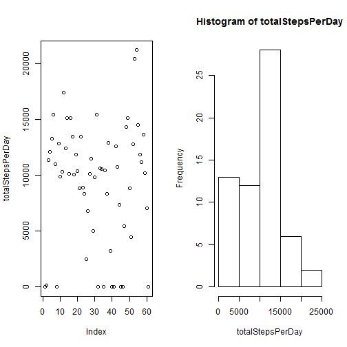

# Reproducible Research: Peer Assessment 1


## Loading and preprocessing the data

Read and present the data

```r
t=read.csv("activity.csv")
head(t)
```

```
##   steps       date interval
## 1    NA 2012-10-01        0
## 2    NA 2012-10-01        5
## 3    NA 2012-10-01       10
## 4    NA 2012-10-01       15
## 5    NA 2012-10-01       20
## 6    NA 2012-10-01       25
```

```r
summary(t)
```

```
##      steps               date          interval   
##  Min.   :  0.0   2012-10-01:  288   Min.   :   0  
##  1st Qu.:  0.0   2012-10-02:  288   1st Qu.: 589  
##  Median :  0.0   2012-10-03:  288   Median :1178  
##  Mean   : 37.4   2012-10-04:  288   Mean   :1178  
##  3rd Qu.: 12.0   2012-10-05:  288   3rd Qu.:1766  
##  Max.   :806.0   2012-10-06:  288   Max.   :2355  
##  NA's   :2304    (Other)   :15840
```

```r
# Interval value vs index
plot(seq(1,dim(t)[1]),t$interval,xlab="Row number",ylab="interval")
```

 
It is a saw teeth function  
<br><br>

The first day there is no data. Then we show how the steps are distributed by day (four days are presented, not considering the first day

```r
ts=t[-seq(1,288),]
#ts_day=ts[seq(1,which(ts$interval==max(ts$interval))[1]),]
par(mfrow=c(2,2)) 
ts_day=ts[ts$date=="2012-10-02",]
plot(ts_day$interval,ts_day$steps,type = "l",xlab="interval",ylab="steps")
ts_day=ts[ts$date=="2012-10-03",]
plot(ts_day$interval,ts_day$steps,type = "l",xlab="interval",ylab="steps")
ts_day=ts[ts$date=="2012-10-04",]
plot(ts_day$interval,ts_day$steps,type = "l",xlab="interval",ylab="steps")
ts_day=ts[ts$date=="2012-10-05",]
plot(ts_day$interval,ts_day$steps,type = "l",xlab="interval",ylab="steps")
```

 


## What is mean total number of steps taken per day?

```r
totalStepsPerDay=tapply(t$steps,t$date,function(x) sum(x,na.rm = TRUE))
par(mfrow=c(1,2)) 
plot(totalStepsPerDay)
hist(totalStepsPerDay)
```

 

```r
par(mfrow=c(1,1)) 
#mean
mean(totalStepsPerDay)
```

```
## [1] 9354
```

```r
#median
median(totalStepsPerDay)
```

```
## [1] 10395
```


## What is the average daily activity pattern?

#### Time series plot (i.e. type = "l") of the 5-minute interval (x-axis) and the average number of steps taken, averaged across all days (y-axis)

```r
meanStepsPer5Min=tapply(t$steps,t$interval,function(x) mean(x,na.rm = TRUE))
plot(meanStepsPer5Min,xlab="5 min interval", ylab="mean steps", type="l")
```

 


#### Which 5-minute interval, on average across all the days in the dataset, contains the maximum number of steps?

```r
names(which(meanStepsPer5Min==max(meanStepsPer5Min)))
```

```
## [1] "835"
```


## Imputing missing values  

#### total number of missing values in the dataset (i.e. the total number of rows with NAs)


```r
summary(t)
```

```
##      steps               date          interval   
##  Min.   :  0.0   2012-10-01:  288   Min.   :   0  
##  1st Qu.:  0.0   2012-10-02:  288   1st Qu.: 589  
##  Median :  0.0   2012-10-03:  288   Median :1178  
##  Mean   : 37.4   2012-10-04:  288   Mean   :1178  
##  3rd Qu.: 12.0   2012-10-05:  288   3rd Qu.:1766  
##  Max.   :806.0   2012-10-06:  288   Max.   :2355  
##  NA's   :2304    (Other)   :15840
```

```r
# There are 2304 rows with NA's

# Other way
length(which(is.na(t$steps)))
```

```
## [1] 2304
```

#### Create a new data set with NA replaced by mean value


```r
tnew=t
for (i in seq(1,dim(t)[1])){
  if (is.na(t$steps[i])){
      index=  which(names(meanStepsPer5Min) ==t$interval[i])
      tnew$steps[i]=meanStepsPer5Min[index]
  }
}

head(tnew)
```

```
##     steps       date interval
## 1 1.71698 2012-10-01        0
## 2 0.33962 2012-10-01        5
## 3 0.13208 2012-10-01       10
## 4 0.15094 2012-10-01       15
## 5 0.07547 2012-10-01       20
## 6 2.09434 2012-10-01       25
```

#### Make a histogram of the total number of steps taken each day and Calculate and report the mean and median total number of steps taken per day. Do these values differ from the estimates from the first part of the assignment? What is the impact of imputing missing data on the estimates of the total daily number of steps?

```r
totalStepsPerDay_new=tapply(tnew$steps,tnew$date,function(x) sum(x))
par(mfrow=c(1,2)) 
plot(totalStepsPerDay_new)
hist(totalStepsPerDay_new)
```

 

```r
par(mfrow=c(1,1)) 
#mean
mean(totalStepsPerDay_new)
```

```
## [1] 10766
```

```r
#median
median(totalStepsPerDay_new)
```

```
## [1] 10766
```

```r
# Dates in which the NA's have an impact
which(totalStepsPerDay!= totalStepsPerDay_new)
```

```
## 2012-10-01 2012-10-08 2012-11-01 2012-11-04 2012-11-09 2012-11-10 
##          1          8         32         35         40         41 
## 2012-11-14 2012-11-30 
##         45         61
```

##### We can see that mean and median have increased sustantially


## Are there differences in activity patterns between weekdays and weekends?


```r
tnew$weekday="wd"
tnew$weekday[weekdays(as.Date(tnew$date))=="sabado"]="we"
tnew$weekday[weekdays(as.Date(tnew$date))=="domingo"]="we"
tnew$weekday=as.factor(tnew$weekday)
```


```r
a=tnew[tnew$weekday=="wd",]
meanStepsPer5Min_wd=tapply(a$steps,a$interval,function(x) mean(x))
a=tnew[tnew$weekday=="we",]
meanStepsPer5Min_we=tapply(a$steps,a$interval,function(x) mean(x))
par(mfrow=c(1,2)) 
plot(meanStepsPer5Min_wd,main="working days",xlab="5 min interval", ylab="mean steps", type="l")
plot(meanStepsPer5Min_we,main="weekend days",xlab="5 min interval", ylab="mean steps", type="l")
```

 

#### There are clearly differences in the activity pattern between working days and weekend days


